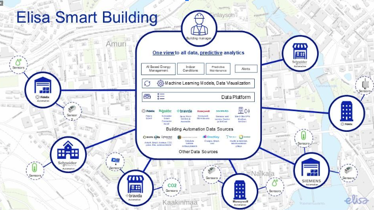

# Elisa Smart Building

## 1 Case description

Elisa Smart Building is a service designed for property management that monitors, among other things, consumption, conditions, and electricity prices, and optimizes energy use in the buildings based on these factors. Consumption data from various meters (e.g., main electricity, district heating) is available for multiple years, and both historical observations and forecast data are collected from every weather station in Finland over the corresponding period from Finnish Meteorological Institute open data API.

**Elisa Smart Building Data Analysis Assignment - Student Walkthrough**

This walkthrough will guide students in processing, cleaning, visualizing, and analyzing Elisa Smart Building data using Python. The assignment focuses on handling energy consumption data, weather data, and deriving insights through analytics and visualizations.

## 2 Required libraries and datasets
